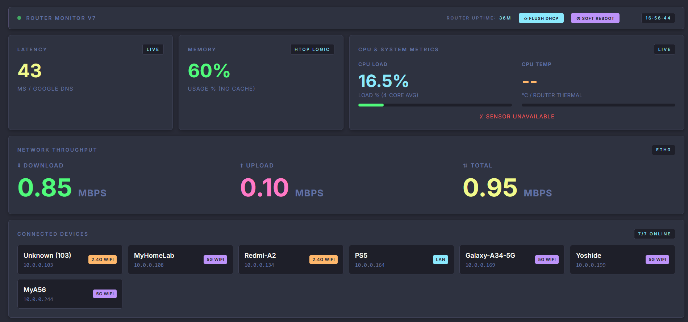
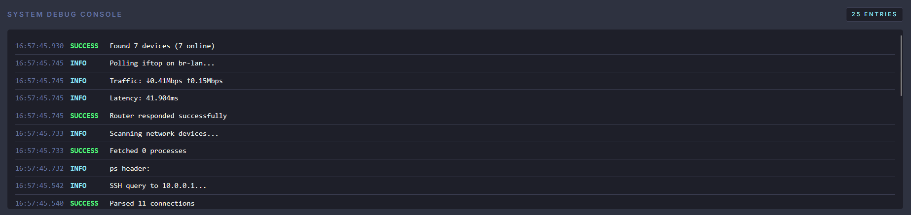

# Network Monitor Dashboard 

A real-time, low-latency telemetry dashboard designed for homelab enthusiasts using OpenWrt routers. This application pulls live metrics directly from your router via SSH and visualizes them through a professional, desaturated "Calm Dark" web interface.

*Updated 01/02/2026
 - new look - dracula VS Code colours used
 - Added a debugging log console
 - fixed Connected Devices to reflect connection type (LAN/WIFI) and to show 2.4Ghz or 5Ghz connection
 - Speed throughput now shows Download and Upload speeds and Total throughput in Mbps
 - Added router RAM usage indicator
 - Added router CPU temp display (still troubleshooting to get it to work)
 - Added button to flush DHCP leases and do a Soft Reboot
 - Fixed Debug Console to show queries and their status





## Key Features

- **Dynamic Throughput**: Real-time Mbps calculation for WAN traffic
- **Semantic Coloring**: Muted color-coding for Latency (Good/Warn/Bad) and Service Tags
- **Identity Awareness**: Automatically differentiates between WiFi and LAN clients using DHCP leases and wireless station dumps
- **Service Intelligence**: Identifies specific traffic types such as HTTPS, SSH, and Speedtests
- **System Health**: Monitors router CPU load and hardware link speeds

## Prerequisites

Before you begin, ensure you have:

- **OpenWrt Router** with SSH access enabled
- **Python 3.7+** installed on your monitoring machine (the computer that will run this dashboard)
- **Network connectivity** between your monitoring machine and router
- **Basic command-line knowledge** for SSH and Python

## Installation Guide

### Step 1: Router Setup

First, install the required packages on your OpenWrt router:

```bash
# SSH into your router
ssh root@192.168.1.1  # Replace with your router's IP

# Update package lists and install dependencies
opkg update
opkg install iftop ethtool

# Exit the router SSH session
exit
```

### Step 2: Configure SSH Key Authentication

Set up passwordless SSH access from your monitoring machine to the router:

```bash
# Generate SSH key (if you don't already have one)
ssh-keygen -t rsa -b 4096

# Copy the key to your router (replace with your router's IP)
ssh-copy-id root@192.168.1.1

# Test passwordless login (should connect without asking for password)
ssh root@192.168.1.1
exit
```

**Note**: If `ssh-copy-id` doesn't work, manually copy your public key:
```bash
cat ~/.ssh/id_rsa.pub | ssh root@192.168.1.1 "cat >> /etc/dropbear/authorized_keys"
```

### Step 3: Set Up the Application

```bash

# Create a Python virtual environment
python3 -m venv venv

# Activate the virtual environment
source venv/bin/activate  # On Linux/macOS
# OR
.\venv\Scripts\activate   # On Windows
```

### Step 4: Install Python Dependencies

```bash
# With the virtual environment activated, install required packages
pip install Flask paramiko
```

### Step 5: Configure the Application

Edit `Network Monitor.py` and update the following constants near the top of the file to match your network:

```python
ROUTER_IP = "192.168.1.1"    # Your OpenWrt router's IP address
INTERFACE = "eth1"            # Your WAN interface name (e.g., eth1, wan, pppoe-wan)
```

**Finding your WAN interface name:**
```bash
# SSH into your router and run:
ip link show
# or
uci show network.wan.device
```

### Step 6: Run the Application

```bash
# Ensure your virtual environment is activated
source venv/bin/activate  # Skip if already activated

# Run the dashboard
python "Network Monitor.py"
```

You should see output indicating Flask is running:
```
 * Running on http://0.0.0.0:5000
```

### Step 7: Access the Dashboard

Open your web browser and navigate to:

- **From the same machine**: `http://localhost:5000`
- **From other devices on your network**: `http://<monitoring-machine-ip>:5000`

Replace `<monitoring-machine-ip>` with the IP address of the computer running the Python application (not your router's IP).

## Structure

```
Network-Monitor-App-with-Python/
├── Dashboard.png          # Screenshot of the dashboard
├── LICENSE                # GNU GPL v3.0 license
├── Network Monitor.py     # Main Flask application and telemetry engine
└── README.md              # This file 
```

